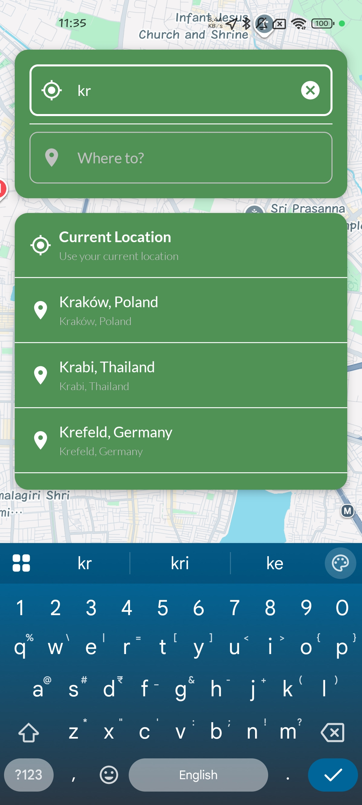
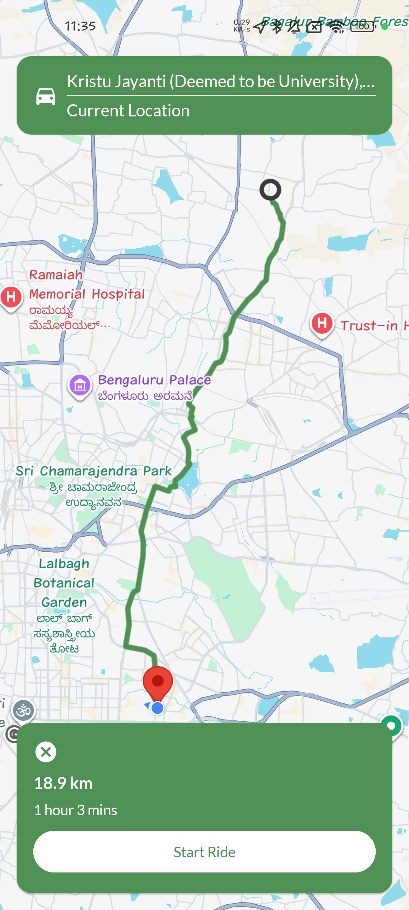
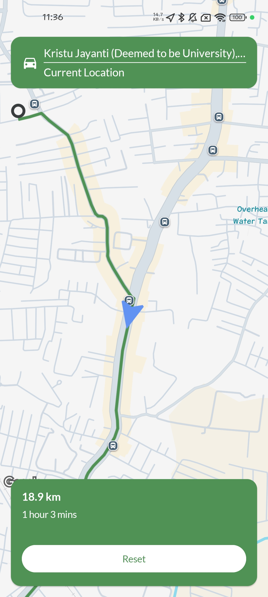

# Maps Navigation Assignment

A modern Android navigation module built using **Jetpack Compose**, **MVVM**, and **Clean Architecture**.

The app allows users to:

* Search for start and destination locations
* View search suggestions
* Display locations on Google Maps
* Draw route polylines
* Animate a vehicle marker from start to destination
* Use current location as start/destination

---

# Tech Stack

## Android

* Kotlin
* Jetpack Compose
* Coroutines + Flow
* Hilt Dependency Injection
* MVVM Architecture

## Maps & Location

* Google Maps Compose
* Google Places API
* Google Directions API
* Fused Location Provider

## Networking

* Ktor Client
* Kotlin Serialization

---

# Architecture

The project follows a layered clean architecture approach.

```text
presentation
    ↓
domain
    ↓
data
```

## Layers

### Presentation Layer

Responsible for:

* UI
* State handling
* User interactions
* Map rendering
* Navigation

### Domain Layer

Responsible for:

* Business models
* Repository contracts
* Core business logic

### Data Layer

Responsible for:

* Remote APIs
* DTOs
* Repository implementation
* Mappers

---

# Features

## Location Search

* Search start and destination
* Live autocomplete suggestions
* Current location option

## Route Rendering

* Polyline route drawing
* Camera bounds fitting
* Route info display

## Vehicle Traversal

* Smooth animated vehicle movement
* Marker rotation based on direction
* Camera follow animation

## UI/UX

* Collapsible search UI
* Ride progress header
* Reset navigation flow
* Modern Compose-based design

---

# Screenshots

## Home / Search Screen

<p align="center">
  
</p>

---

## Route Preview

<p align="center">
  
</p>

---

## Ride Traversal

<p align="center">
  
</p>

---

# APK Download

```text
[https://your-apk-link-here](https://drive.google.com/file/d/1uUzbyixFl2lEpmeZouYjRDzjsQsMknIp/view?usp=sharing)
```

# Project Structure

```text
core/
├── networking/
├── error/
└── result/

presentation/
├── components/
├── navigation/
└── map/

data/
├── remote/
└── repository/

domain/
├── model/
└── repository/
```

---

# Setup Instructions

## 1. Clone Repository

```bash
git clone <repository-url>
```

---

## 2. Add Google Maps API Key

Add your API key inside:

```text
local.properties
```

```properties
MAPS_API_KEY=YOUR_API_KEY
```

---

## 3. Run Application

Open the project in Android Studio and run the app.

---

# API Usage

The application uses:

* Google Places Autocomplete API
* Google Place Details API
* Google Directions API

---

# Highlights

* Clean Architecture
* Reactive UI using StateFlow
* Reusable Compose Components
* Smooth Map Animations
* Modularized Code Structure
* Error Handling
* Type Safe Navigation

---

# Future Improvements

* Dark map theme
* Route alternatives
* Live navigation updates
* Offline caching
* Voice navigation
* ETA recalculation

---

# Author

Abhijaan Ganguly
